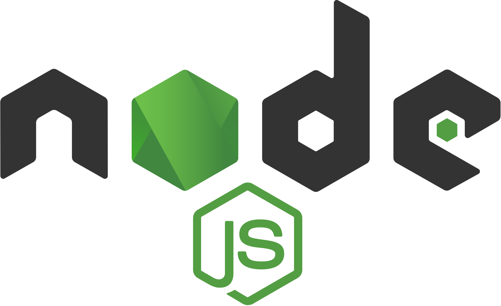
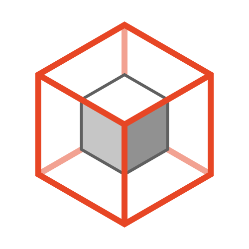
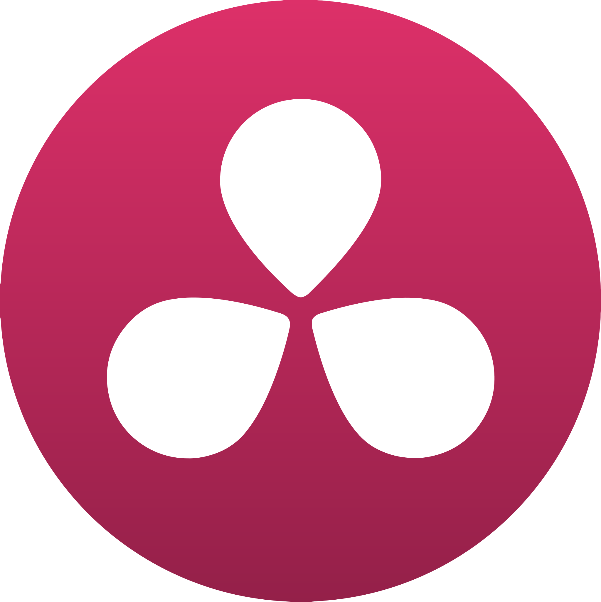

<h1 align = 'center'>👋 Hi, I'm Dreas Weiss,  
 a fullstack web developer JS
</h1>

Passionate about technology from an early age, I’ve spent most of my life in IT. Over the years, I’ve gained versatile experience across development, design, and team management.
 
 
In summer 2024, I relocated to Germany and I’m eager to take on new challenges and continue developing professionally. Currently, I’m focused on growing as a Frontend Developer and improving my German (B1 level).

---
## 💬 Contact me
 
 
or you can write me on email: dreasweiss@gmail.com 📫

---

## Some Tool and Tech I use

          

      

     

                                
  
 
           

        
 
 also: seo, yandex direct, google adsence
 
 ---

   
<b> 👨‍🎓 Courses </b>

|issue date|platform|hours|tech|course/cerificate|
| --- | --- | --- | --- | --- |
| july 2024 | [stepik](https://stepik.org/course/209011/info) | 4 |  | [Git Basics](https://stepik.org/cert/2529152?lang=en)
| july 2024 | [stepik](https://stepik.org/course/171974/info) | 3 |  | [We study Git and GitHub in 3 hours in practice](https://stepik.org/cert/2527911?lang=en)
| march 2024 | [stepik](https://stepik.org/course/186300/info) | 16 |  | Basics React, React Router and Redux Toolkit
| march 2024 | [udemy](https://www.udemy.com/course/30-react-projects-learn-react-js-by-building-30-web-apps/) | 13 |  | [30+ React Projects, Learn React JS by Building 30+ Web Apps](https://github.com/DreasWeiss/30ReactPr)
| apr 2023 | [udemy](https://www.udemy.com/course/telegram-mono-currency-bot/) | 1 |   | Telegram Bot "Current Course" on Node.js and Monobank API
| mar 2023 | [freecodecamp](https://www.freecodecamp.org/learn/back-end-development-and-apis/) | 300 |   | [Back End Development and APIs](https://www.freecodecamp.org/certification/dreasweiss/back-end-development-and-apis)
| dec 2022 | [stepik](https://stepik.org/course/73/info) | 10 |  | [Introduction to Linux](https://stepik.org/cert/1888144)
| dec 2022 | [stepik](https://stepik.org/course/52226/info) | 1 |   | [Young Fighter Course in IT](https://stepik.org/cert/1876461)
| jul 2021 | [freecodecamp](https://www.freecodecamp.org/learn/javascript-algorithms-and-data-structures/) | 300 |  | [JavaScript Algorithms and Data Structures](https://www.freecodecamp.org/certification/dreasweiss/javascript-algorithms-and-data-structures)

   
<b> 📄 GitHub Pages </b>

|link|tech|description|github|
| --- | --- | --- | --- |
| [FiverrQrious](https://dreasweiss.github.io/fiverr_qrious/) | HTML CSS JavaScript | it was the task from fiver. design provided by the client | [github](https://github.com/DreasWeiss/fiverr_qrious)|
| [FiverrHubTags](https://dreasweiss.github.io/FiverrHubTags/) | HTML CSS SCSS | it was the task from fiver. The customer left very good review and tips | [github](https://github.com/DreasWeiss/FiverrHubTags)|
| [GmailSignatureCarl](https://dreasweiss.github.io/GmailSignatureCarl/) | JavaScript HTML CSS | online email signature generator for the customer from upwork. the client uses this site to make signatures to the employees of his company | [github](https://github.com/DreasWeiss/GmailSignatureCarl)|
| [s-hild.ru](https://dreasweiss.github.io/s-hild.ru/) | HTML CSS | business card website - local commercial store (the main request of the customer - quickly and cheaply) it is very simple - but this site brings money and customers to the customer for several years | [github](https://github.com/DreasWeiss/s-hild.ru)|
| [TributePage](https://dreasweiss.github.io/fccTributePage/) | HTML CSS | html/css course project freecodecamp | [github](https://github.com/DreasWeiss/fccTributePage)|
| [DesignerPortfolio](https://dreasweiss.github.io/site_DesignerPortfolio/) | HTML CSS JavaScript | html/css/js training project | [github](https://github.com/DreasWeiss/site_DesignerPortfolio)|
| [ActiveBox](https://dreasweiss.github.io/site_ActiveBox/) | HTML CSS JavaScript | html/css/js training project | [github](https://github.com/DreasWeiss/site_ActiveBox)|

