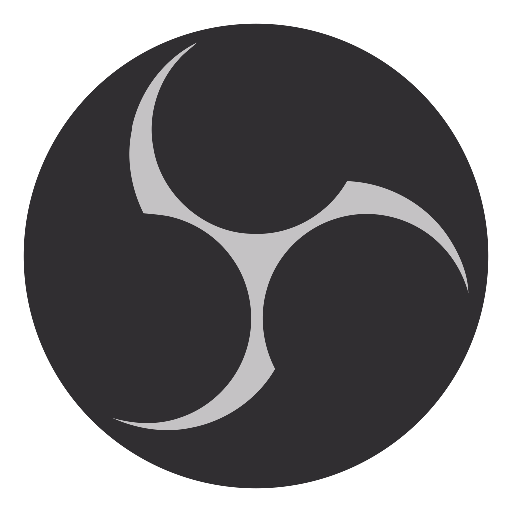

<h1 align = 'center'>👋 Hi, I'm Dreas Weiss,  
 a fullstack web developer JS
</h1>

I began dabbling in code three years ago starting with the standard HTML, CSS and JavaScript. I have recently started learning node js and react, and have plan to try react native after. Firstly, web development was like a hobby, but now has become a career move for me, so I bring an enthusiasm and commitment to learning that comes with dedicated yourself to something.
 
 
What I’m currently looking for is a happy work environment with peers committed to their related crafts as I am committed to mine. Though I don’t need babysitting, I would love to have a senior peer to check my work and give me advice regarding the steps required for my own development.

---
## Contact me
 
 
or you can write me on email: dreasweiss@gmail.com

---

## Some Tool and Tech I use

          

     

    

                          
 
           

        
 
 also: seo, yandex direct, google adsence
 
 ---

   
<b> 👨‍🎓 Courses </b>

|issue date|platform|hours|cerificate|
| --- | --- | --- | --- |
| dec 2022 | [stepik](https://stepik.org/course/73/info) | 10 | [Introduction to Linux](https://stepik.org/cert/1888144)
| dec 2022 | [stepik](https://stepik.org/course/52226/info) | 1 | [Young Fighter Course in IT](https://stepik.org/cert/1876461)
| jul 2021 | [freecodecamp](https://www.freecodecamp.org/learn/javascript-algorithms-and-data-structures/) | 300 | [JavaScript Algorithms and Data Structures](https://www.freecodecamp.org/certification/dreasweiss/javascript-algorithms-and-data-structures)

### 

<!--
**DreasWeiss/DreasWeiss** is a ✨ _special_ ✨ repository because its `README.md` (this file) appears on your GitHub profile.

Here are some ideas to get you started:

- 🔭 I’m currently working on ...
- 🌱 I’m currently learning ...
- 👯 I’m looking to collaborate on ...
- 🤔 I’m looking for help with ...
- 💬 Ask me about ...
- 📫 How to reach me: ...
- 😄 Pronouns: ...
- ⚡ Fun fact: ...
-->
